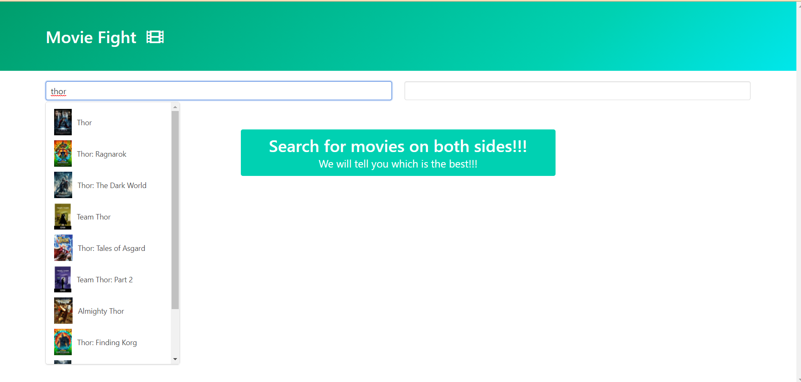
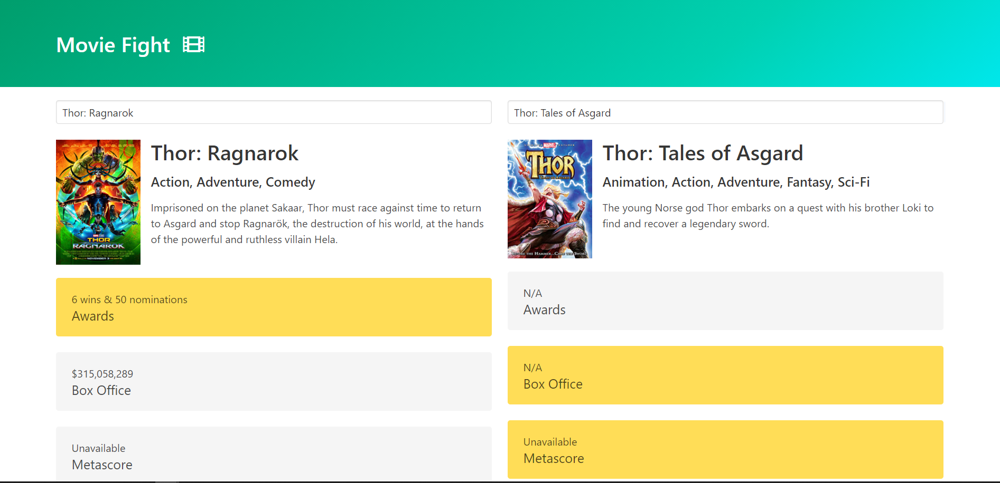

# Application Design Pattern

## Overview

- This is a web application which let's user search for a particular movie, and get suggestions while he is typing it.

- Then user can do the same for the some other movie, he/she wants to find information related to and then compare it side by side.

## Stack

Following is the stack used for creating the application

- Javascript
  - Plain vanilla JS is used along with [axios](https://github.com/axios/axios) for making http requests
- CSS
  - The CSS framework used is [Bulma](https://bulma.io/) to develope responsive interface
- HTML

The API used : [OMDb API](https://www.omdbapi.com/), which is a RESTful web service to obtain movie information.
